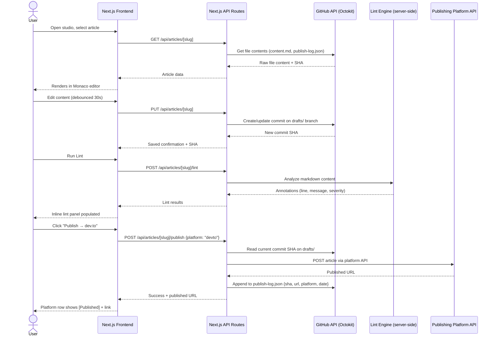
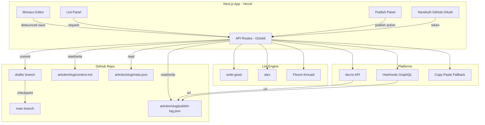

# Inkwell — Personal Writing Studio backed by GitHub

> Write like a developer. Publish like a creator.

---

## Table of Contents

1. [Problem & Solution](#1-problem--solution)
2. [Vision](#2-vision)
3. [Business View & Limitations](#3-business-view--limitations)
4. [App-Level Solution](#4-app-level-solution)
   - [UX Sketch](#41-ux-sketch)
   - [Architecture Overview](#42-architecture-overview)
   - [Data Flow Diagram](#43-data-flow-diagram)
   - [GitHub Repo as CMS](#44-github-repo-as-cms)
5. [Tech Stack, Alternatives & Trade-offs](#5-tech-stack-alternatives--trade-offs)
6. [Feature Backlog](#6-feature-backlog)

---

## 1. Problem & Solution

### The Problem

Developers who write articles face a fragmented workflow:

- **Writing tools** (Notion, Google Docs) lack version control, Git history, and code-friendly formatting
- **Git-native editors** (VS Code) have no publishing pipeline or platform adapters
- **Publishing platforms** (dev.to, Medium, Substack) are siloed — no cross-platform history, no version snapshots, no audit trail of *what version went where*
- **Collaboration review** requires exporting and importing drafts manually, breaking the flow
- Linting for grammar, style, and readability exists in scattered CLI tools — none integrated into a writing IDE

The result: a developer-writer maintains 3–5 different tools, loses version history when publishing, and has no record of what they shipped.

### The Solution

**Inkwell** is a personal, browser-based markdown writing studio where **your GitHub repository is the CMS**.

- Write in a Monaco editor (the VS Code engine) in the browser
- Every save is a GitHub commit — full version history for free
- Lint inline: grammar, style, readability — before you publish
- Publish to platforms via API or formatted copy-paste, and log exactly *which commit SHA* went to *which platform* and *when*
- Every article carries a `publish-log.json` — your personal publishing ledger, stored in the repo

---

## 2. Vision

> **"Treat your articles the way you treat your code."**

A solo developer-writer should be able to:

- Open their writing studio in a browser tab
- Pick up any article from their GitHub repo exactly where they left it
- Write, lint, and review — without leaving the environment
- Click "publish" and have the right formatted version go to the right platform
- See the full history: when was this version published, where, which commit SHA

The long-term vision is a **local-first, Git-native content operating system** — where publishing platforms are just deployment targets, and your GitHub repo is the single source of truth for all your written work.

---

## 3. Business View & Limitations

### Business View

| Dimension | Detail |
|---|---|
| **User** | Solo developer-writer (personal tool, single GitHub account) |
| **Value proposition** | Git-backed writing + cross-platform publishing ledger in one UI |
| **Deployment** | Vercel (free tier) — zero infra cost for a personal tool |
| **Monetization** | N/A — personal productivity tool, not a SaaS product |
| **Competitive moat** | The combination of code-review-style versioning + publishing ledger doesn't exist as a standalone personal tool |

### Limitations (MVP Scope)

| Limitation | Reason |
|---|---|
| **Single user only** | No multi-tenant auth, no team workspaces |
| **One GitHub repo** | Selected once at login; no multi-repo support in MVP |
| **No real-time collaboration** | Not a Google Docs replacement — review is read-only snapshot sharing |
| **Platform API coverage is partial** | Medium deprecated API; Substack has no public API — copy-paste fallback is intentional |
| **No offline mode** | Requires GitHub API access; no local-first sync in MVP |
| **No image management** | Images must be hosted externally (GitHub raw, CDN); no upload pipeline in MVP |
| **Auto-save creates dense commit history** | Mitigated by draft-branch strategy but not fully squashed in MVP |

---

## 4. App-Level Solution

### 4.1 UX Sketch

```
┌─────────────────────────────────────────────────────────────────────┐
│  Inkwell                                          [avatar] [repo ▾] │
├───────────────┬─────────────────────────────┬───────────────────────┤
│               │                             │                       │
│  ARTICLES     │     content.md              │   LINT PANEL          │
│  ──────────   │     ─────────────────────   │   ──────────────────  │
│  ▶ my-slug    │                             │   ● Readability  B+   │
│    another    │   # My Article Title        │   ● 2 style issues    │
│    draft-wip  │                             │   ● 0 grammar errors  │
│               │   Some paragraph text...    │                       │
│  [+ New]      │   with **markdown** and     │   Line 14: avoid      │
│               │   `inline code`.            │   "very" — weakens    │
│               │                             │   your point          │
│               │                             │                       │
│               │                             │   [Run Lint ↺]        │
│               │                             │                       │
├───────────────┴──────────────┬──────────────┴───────────────────────┤
│  VERSIONS                    │  PUBLISH                             │
│  ────────────────────────    │  ─────────────────────────────────   │
│  ● abc1234  today 14:02      │  dev.to     [Published v3] [Open ↗]  │
│    def5678  yesterday        │  Hashnode   [Publish →]              │
│    aaa9999  3 days ago       │  Medium     [Copy HTML ⎘]            │
│                              │  Substack   [Copy Markdown ⎘]        │
│  [Restore]  [View diff]      │  LinkedIn   [Copy Plain ⎘]           │
└──────────────────────────────┴──────────────────────────────────────┘
```

**Key UX decisions:**
- **Three-panel layout**: article list (left), editor (center), context panel (right — toggles between Lint and Publish)
- **Version strip** lives below the editor — always visible, not hidden in a modal
- **Publish panel** shows per-platform status at a glance: already published, publishable, or copy-paste only
- **No modal-heavy flows** — everything is inline, developer-style

---

### 4.2 Architecture Overview

#### Frontend (Next.js App Router)

```
app/
├── (auth)/
│   └── login/             ← GitHub OAuth entry point
├── studio/
│   ├── page.tsx           ← Article list (reads repo tree via Octokit)
│   ├── [slug]/
│   │   └── page.tsx       ← Editor view for a single article
├── api/
│   ├── auth/[...nextauth] ← NextAuth GitHub provider
│   ├── articles/
│   │   ├── route.ts       ← List articles (GET repo tree)
│   │   ├── [slug]/
│   │   │   ├── route.ts   ← Read / write content.md via Octokit
│   │   │   ├── versions/  ← List commits for articles/{slug}/
│   │   │   ├── lint/      ← Run write-good + readability on content
│   │   │   └── publish/   ← Write publish-log.json, call platform APIs
```

#### Backend (Next.js API Routes — no separate server)

All backend logic lives in Next.js API routes. GitHub is the only persistence layer. No database.

| API Route | Responsibility |
|---|---|
| `GET /api/articles` | Read `articles/` dir tree from GitHub repo |
| `GET /api/articles/[slug]` | Fetch `content.md` + `meta.json` + `publish-log.json` |
| `PUT /api/articles/[slug]` | Commit updated `content.md` to draft branch |
| `POST /api/articles/[slug]/publish` | Format-convert, call platform API (or skip), write `publish-log.json` entry |
| `GET /api/articles/[slug]/versions` | List commits touching `articles/[slug]/` |
| `POST /api/articles/[slug]/lint` | Run linting pipeline, return annotated results |

#### GitHub Branching Strategy

```
main              ← published / versioned truth
  └── drafts/     ← auto-save commits go here (debounced, every 30s)
        └── merge on "Checkpoint" action → creates tagged commit on main
```

This keeps `main` history clean and readable — only intentional versions appear in the version strip.

---

### 4.3 Data Flow Diagram





---

### 4.4 GitHub Repo as CMS

Every article is a folder. Every folder is self-contained.

**`publish-log.json` schema:**

```json
{
  "article": "my-article-slug",
  "entries": [
    {
      "platform": "devto",
      "commit_sha": "abc1234ef",
      "branch": "main",
      "published_at": "2025-03-15T10:30:00Z",
      "url": "https://dev.to/linnie/my-article",
      "format": "markdown",
      "platform_id": "1234567"
    },
    {
      "platform": "substack",
      "commit_sha": "abc1234ef",
      "branch": "main",
      "published_at": "2025-03-16T08:00:00Z",
      "url": "https://mysubstack.com/p/my-article",
      "format": "html",
      "platform_id": null,
      "note": "copy-paste — manually published"
    }
  ]
}
```

**`meta.json` schema:**

```json
{
  "title": "My Article Title",
  "slug": "my-article-slug",
  "description": "Short SEO description",
  "tags": ["typescript", "aws", "architecture"],
  "status": "draft",
  "created_at": "2025-03-10T09:00:00Z",
  "updated_at": "2025-03-15T10:00:00Z"
}
```

---

## 5. Tech Stack, Alternatives & Trade-offs

### Core Choices

| Layer | Chosen | Why |
|---|---|---|
| Framework | **Next.js 15 (App Router)** | TypeScript-native, API routes replace a separate backend, Vercel deploy is zero-config |
| Auth | **NextAuth.js v5 + GitHub OAuth** | GitHub OAuth covers both identity and repo access with a single token scope |
| GitHub I/O | **Octokit.js** | Official GitHub SDK; handles REST + pagination; strong TypeScript types |
| Editor | **Monaco Editor** (`@monaco-editor/react`) | VS Code engine in browser; markdown syntax, keyboard shortcuts already familiar |
| Markdown rendering | **unified / remark / rehype** | AST-based pipeline; linting and format-conversion plug directly into the same AST |
| Linting | **write-good + alex + custom Flesch-Kincaid** | All JS/TS, runs server-side in API routes; no external service dependency |
| Styling | **Tailwind CSS** | Utility-first, fast iteration, no context switching |
| Deploy | **Vercel** | Free tier, zero config, edge functions available if needed |

---

### Alternatives & Trade-off Analysis

#### Framework

| Option | Pros | Cons | Verdict |
|---|---|---|---|
| **Next.js 15** ✅ | Full-stack, App Router, Vercel native, TypeScript | Opinionated routing, RSC mental model overhead | **Chosen** |
| SvelteKit | Lighter, ergonomic, fast | Smaller ecosystem, fewer editor libs | Viable but ecosystem risk |
| Remix | Excellent data loading model | Less Vercel-native, fewer UI lib integrations | Overkill for personal tool |
| Vite + Express | Full control | Two repos, more boilerplate, no SSR out of the box | Not worth it at this scale |

#### Editor

| Option | Pros | Cons | Verdict |
|---|---|---|---|
| **Monaco Editor** ✅ | Familiar (VS Code), markdown support, extensible | Heavy bundle (~2MB); requires dynamic import | **Chosen** — code-split it |
| CodeMirror 6 | Lighter, more composable, excellent mobile | Different mental model, more setup for markdown | Strong alternative |
| Milkdown | WYSIWYG markdown, beautiful UX | Less control, harder to lint at AST level | Wrong direction for dev-audience |
| Plain `<textarea>` | Zero weight | No syntax highlighting, no keybindings | MVP escape hatch only |

#### Auth & GitHub Integration

| Option | Pros | Cons | Verdict |
|---|---|---|---|
| **NextAuth + GitHub OAuth** ✅ | Single OAuth flow covers auth + repo access | Token scopes must be set carefully (`repo` scope is broad) | **Chosen** |
| GitHub App | Finer-grained permissions, better for multi-user | More setup complexity, overkill for personal tool | Future consideration |
| Personal Access Token (manual) | Simplest possible | Not a real auth flow; breaks the "web app" feel | Prototyping only |

#### Data Persistence (GitHub as DB)

| Option | Pros | Cons | Verdict |
|---|---|---|---|
| **GitHub repo via Octokit** ✅ | Free, versioned by default, portable, no infra | API rate limits (5k req/hr), latency per save, dense commit history | **Chosen** — personal tool rate limits are not a concern |
| PlanetScale / Supabase | Fast queries, relational | Costs money, loses the "repo as CMS" property entirely | Over-engineered for scope |
| SQLite on Vercel | Lightweight | Vercel filesystem is ephemeral; need Turso or similar | Adds infra complexity |
| Local filesystem + git push | Zero latency | Requires desktop app, breaks browser-native goal | Different product |

#### Linting

| Option | Pros | Cons | Verdict |
|---|---|---|---|
| **write-good + alex + custom FK** ✅ | Pure JS, no external service, fast, customizable | Not as smart as LLM-based suggestions | **Chosen** for MVP |
| LanguageTool (API) | Excellent grammar, multilingual | External API dependency, rate limits, latency | Add in v2 |
| Vale | Highly configurable style linting | Go binary, harder to run in Vercel API route | CLI tool for power users — optional integration |
| LLM-based (Claude API) | Context-aware, tone-sensitive | Cost per request, latency, overkill for syntax | Backlog feature (AI suggestions panel) |

---

## 6. Feature Backlog

Priority: **P0** = MVP blocker · **P1** = MVP nice-to-have · **P2** = v2 · **P3** = future

### Authentication & Setup

| ID | Feature | Priority | Notes |
|---|---|---|---|
| A-01 | GitHub OAuth login via NextAuth | P0 | `repo` scope required |
| A-02 | Repo picker on first login | P0 | Store selected repo in session |
| A-03 | Logout + session management | P0 | |
| A-04 | Multi-repo support | P3 | Switch repos without re-auth |

### Article Management

| ID | Feature | Priority | Notes |
|---|---|---|---|
| M-01 | List articles from GitHub repo `articles/` dir | P0 | Read repo tree via Octokit |
| M-02 | Create new article (slug, title, meta.json) | P0 | Commits scaffold to `drafts/` |
| M-03 | Delete article (archive, not hard delete) | P2 | Move to `archived/` folder |
| M-04 | Rename / reslug article | P2 | Updates folder name + all log references |
| M-05 | Search articles by title / tag | P2 | Client-side filter in MVP |
| M-06 | Tag / filter articles | P2 | Based on `meta.json` tags |

### Editor

| ID | Feature | Priority | Notes |
|---|---|---|---|
| E-01 | Monaco Editor with markdown syntax | P0 | Dynamic import, code-split |
| E-02 | Live markdown preview (split pane) | P0 | remark + rehype pipeline |
| E-03 | Debounced auto-save to `drafts/` branch | P0 | 30s debounce, show save status |
| E-04 | Manual "Checkpoint" action → tagged commit on `main` | P1 | Keeps main history clean |
| E-05 | Word count + reading time in status bar | P1 | |
| E-06 | Front matter editor (title, description, tags) | P1 | Edit `meta.json` inline |
| E-07 | Keyboard shortcuts (save, lint, toggle preview) | P1 | |
| E-08 | Full-screen / zen mode | P2 | |
| E-09 | Custom Monaco theme matching app design | P2 | |
| E-10 | Table of contents auto-generated from headings | P2 | |
| E-11 | Mermaid diagram preview | P3 | |

### Versioning

| ID | Feature | Priority | Notes |
|---|---|---|---|
| V-01 | Version strip: list commits for current article | P0 | Octokit `listCommits` filtered by path |
| V-02 | View content at any historical commit | P1 | Read blob by SHA |
| V-03 | Diff view between two versions | P2 | Side-by-side unified diff |
| V-04 | Restore version (commit restored content to `drafts/`) | P2 | |
| V-05 | Named versions / release tags | P3 | Git tags on publish events |

### Linting

| ID | Feature | Priority | Notes |
|---|---|---|---|
| L-01 | Style lint via write-good (inline annotations) | P0 | |
| L-02 | Inclusive language check via alex | P0 | |
| L-03 | Readability score (Flesch-Kincaid) | P0 | |
| L-04 | Lint runs on demand (button) | P0 | |
| L-05 | Auto-lint on save | P1 | |
| L-06 | Lint severity filter (error / warning / info) | P1 | |
| L-07 | Grammar check via LanguageTool API | P2 | External service |
| L-08 | SEO check (meta description length, keyword density) | P2 | Based on `meta.json` description |
| L-09 | Broken link checker | P2 | Fetch links, check 200 status |
| L-10 | AI-powered suggestions (Claude API) | P3 | Tone, clarity, structure feedback |

### Publishing & Ledger

| ID | Feature | Priority | Notes |
|---|---|---|---|
| P-01 | Publish panel UI per article | P0 | Shows platform list + status |
| P-02 | Read `publish-log.json` and display per-platform status | P0 | |
| P-03 | dev.to publish via API | P1 | API key stored in user settings |
| P-04 | Hashnode publish via GraphQL API | P1 | |
| P-05 | Copy-paste fallback for Medium (HTML format) | P0 | Clipboard API |
| P-06 | Copy-paste fallback for Substack (markdown) | P0 | Clipboard API |
| P-07 | Copy-paste fallback for LinkedIn (plain text) | P0 | Clipboard API |
| P-08 | Write publish-log.json entry on every publish action | P0 | Includes SHA, URL, platform, date |
| P-09 | Mark manual publish (copy-paste) with URL input | P1 | User inputs the URL after manual post |
| P-10 | Re-publish (update) existing platform post | P2 | Uses `platform_id` from log |
| P-11 | Publish history timeline view across all articles | P2 | Cross-article publishing dashboard |
| P-12 | RSS feed generated from published articles | P3 | From `publish-log.json` entries |

### Sharing / Pre-publish Review

| ID | Feature | Priority | Notes |
|---|---|---|---|
| S-01 | Generate shareable read-only link for current version | P1 | `/preview/[sha]/[slug]` — no auth required |
| S-02 | Preview page renders article markdown (no editor) | P1 | Public route, read from GitHub by SHA |
| S-03 | Link stored in `publish-log.json` as platform `"preview"` | P1 | |
| S-04 | Expiring preview links | P3 | Requires a lightweight token store |

### Settings

| ID | Feature | Priority | Notes |
|---|---|---|---|
| CF-01 | API key management (dev.to, Hashnode) | P1 | Stored in `localStorage` — never in repo |
| CF-02 | Default lint rules toggle | P2 | |
| CF-03 | Custom style guide rules | P3 | Upload a Vale-compatible config |

---

*Generated: March 2026 · Stack: Next.js 15 · Auth: GitHub OAuth · Storage: GitHub repo · Deploy: Vercel*