# From Baseline to Performance-Aware Architecture

*A field guide for diagnosing, naming, and fixing the performance constraints that emerge as systems grow — told through a real-world story.*

`Architecture` · `Performance Engineering` · `Distributed Systems` · `SRE`

---

Most systems don't "get slow" all at once. They get slow in specific, nameable ways: latency grows for distant users, payloads bloat, p99 spikes appear under load, threads stall, database hot spots emerge, and retries quietly turn a small incident into a cascade.

The difference between a system that feels mysterious and one that's debuggable is rarely cleverness — it's whether you can **name the constraint, measure it, and pick the right structural change**.

This article is a guide for going from a minimal "it works" baseline to a performance-aware architecture using a consistent analytical framework. We'll walk through that journey with a running example: **"Neighborhood Moments,"** a hypothetical photo-sharing app for local events that starts with 20 friends and grows to tens of thousands of users over nine weeks. Every change is driven by a real complaint, confirmed by real metrics, and traded off honestly.

> **Two Principles That Anchor Everything**
>
> 1. **Measurement comes first.** SLIs/SLOs, percentiles, and consistent observability (Golden Signals + USE/RED) keep you from "optimizing vibes."
> 2. **Every optimization buys performance with complexity.** CDNs introduce invalidation concerns; queues introduce eventual consistency; caches introduce staleness; sharding introduces cross-shard pain. None of this is "bad" — it's the actual cost of scale.

---

## The Running Example: Neighborhood Moments

Before we get into frameworks and diagrams, meet the app.

Neighborhood Moments is a photo-sharing platform for local events and classifieds — think a local version of Instagram crossed with Nextdoor. Week 1, it's 20 friends in one city. By Week 9, it's tens of thousands of users spread across multiple countries.

The initial tech stack is deliberately simple: a single-page frontend, a monolithic Node/Python app server, and one relational database. Images are uploaded directly to the server, which resizes them on-the-fly. Users load a feed page that serves HTML and image URLs; the browser fetches images directly from the origin.

Initial metrics look fine locally — median TTFB around 100–200ms, LCP at 1–2 seconds, backend p95 latencies under 200ms. No CDN. No cache. No queue. Everything fits on one diagram:

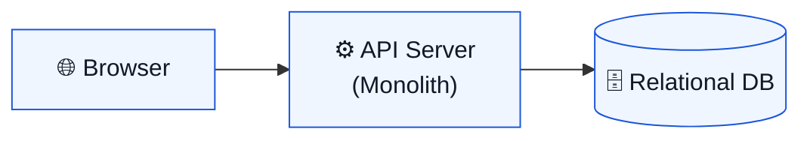

That's the baseline. It's honest, fast to build, and temporarily sufficient. The illusion is that the same shape will hold under real user distribution, real concurrency, and real data growth. It won't. But we can't know — yet — which assumption breaks first. That's exactly why **observability comes before optimization**.

---

## The Performance Thinking Framework

For each bottleneck we encounter, we'll apply the same analytical template. This isn't ceremony — it's a repeatable way to turn "it's slow" into "this is a tail-latency and saturation problem at the database connection pool."

| Step | What You're Doing |
|---|---|
| **Problem statement** | State the constraint in technical terms. |
| **Stakeholder phrasing** | Translate how the business or user describes it. |
| **Locate it** | Find it using metrics, logs, traces, and profiles. |
| **Root cause category** | Classify: network, compute, I/O, data, or coordination. |
| **Architectural change** | Introduce one structural change at a time. |
| **Trade-offs** | Accept the costs openly — there's always a cost. |

---

## Measurement First: Observability as Architecture

Before you add a CDN, a cache, or a queue, you need to answer a basic question: *what got slower, for whom, and why?* This isn't optional instrumentation you add after things break. It's the first architectural decision.

### SLIs, SLOs, and Why Averages Lie

- **Problem:** Without explicit SLIs/SLOs, teams argue with averages, optimize the wrong thing, and discover regressions via angry users.
- **Stakeholder phrasing:** "Are we meeting our reliability goals?" "Is performance getting worse?" "Can we safely ship this?"
- **Root cause:** Coordination failure between humans, caused by bad measurement.

A practical starter set for a web system:

- **Availability SLI:** successful requests / total requests, per endpoint class.
- **Latency SLI:** p50 / p95 / p99 server-side latency for successful requests — separate success vs. error latency.
- **Freshness SLI:** maximum acceptable staleness for cached or replicated reads (if applicable).
- **Queue processing SLI:** time-in-queue and end-to-end job completion time (if asynchronous work exists).

Setting targets creates accountability and forces prioritization. Set SLOs unrealistically high and you'll throttle product velocity; set them too low and users churn. **Error budgets make this tension explicit and resolvable.**

### Percentiles: Average Is a Story, p99 Is an Experience

In distributed systems, tail latency isn't a rounding error — it often defines whether your user perceives the system as "fast" or "randomly broken." Tail behavior gets worse as you compose multiple service calls into one user action.

> *"The average looks fine. Why are users complaining?"*
> — Every engineering team, eventually

The answer is almost always visible in p95 and p99. Your dashboard and alerting should:

- Prioritize percentiles over averages
- Clearly separate "success latency" from "error latency"
- Correlate spikes with saturation signals: CPU, DB locks, queue depth

### OpenTelemetry + Golden Signals + USE/RED

- **Problem:** You can't reliably localize bottlenecks using only logs. Modern systems need metrics (trends), traces (causal paths), and logs (event detail), tied together by consistent context propagation.

Three complementary mental models give you full coverage:

- **Golden signals** (service health): latency, traffic, errors, saturation. Google's SRE guidance calls these out as covering most user-impacting failures.
- **USE method** (resource bottlenecks): utilization, saturation, errors — popularized by Brendan Gregg as a fast "don't miss the obvious" approach.
- **RED method** (request-driven services): rate, errors, duration — particularly useful for microservice dashboards.

Standardize on OpenTelemetry for instrumentation, propagate trace IDs end-to-end, and build dashboards around these three models. The payoff is sharply reduced mean time to understand (MTTU) during incidents.

> **Measurement Checklist (Non-Negotiable)**
>
> - ✅ Define 3–5 "top journeys" (login, feed, upload, dashboard load) and map them to endpoints.
> - ✅ Track golden signals for each journey class, especially p95/p99 latency.
> - ✅ Add at least one saturation metric per tier: API CPU, DB CPU/locks, queue depth.
> - ✅ Ensure traces cross service boundaries via consistent context propagation.
> - ✅ Decide what "slow" means with an SLO, then alert on SLO burn — not random thresholds.

---

## The Story: Nine Weeks of Growth

Here's how Neighborhood Moments evolves, one constraint at a time. Each week, a real complaint. Each complaint, a measurable signal. Each signal, one structural change.

---

### Weeks 2–3: "Our friends in other cities say it's painfully slow"

- **Problem:** Users far from the origin server experience higher round-trip time and substantially higher latency for static and cacheable content.
- **Locate it:** Browser metrics show TTFB spiking above 1 second for remote clients, while the origin server's CPU and network look normal. A latency heatmap by geography makes the pattern unmistakable.
- **Root cause:** Network — latency due to physical distance and routing. A round-trip from Asia to a U.S. server easily adds 250–300ms before anything loads.
- **Architectural change:** Insert a CDN so users hit nearby edge caches instead of always round-tripping to origin.

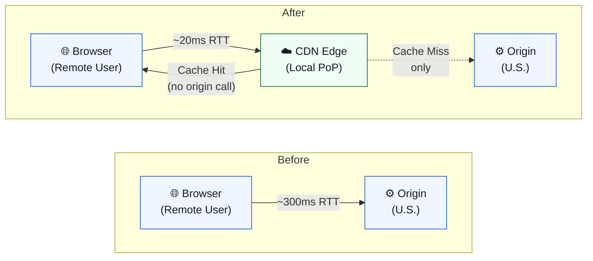

In practice, the 75th-percentile TTFB and LCP drop into the "good" range once assets are cached at the edge. Google's Core Web Vitals benchmark targets LCP under 2.5 seconds; this change often gets you there for global users.

> **⚠️ Trade-Offs**
>
> - Cache invalidation and freshness become real operational concerns. Stale content can linger unless you implement short TTLs or cache-busting.
> - Roll out CDN caching for static assets first; expand to cacheable API content only when you can state your caching rules precisely.
> - Monitor origin offload rate and cache hit ratio, not just TTFB.

---

### Weeks 3–4: "The feed page is slow to render even on fast connections"

- **Problem:** Large payloads (JSON, JS bundles, images) inflate transfer time. HTTP compression is a primary lever but needs a deliberate infrastructure point to apply it consistently.
- **Locate it:** Browser waterfall charts reveal payload sizes and transfer times. Compression is negotiated via `Accept-Encoding` and reported by `Content-Encoding`.
- **Root cause:** Network bandwidth plus I/O (transfer size).
- **Architectural change:** Add a gateway/reverse proxy layer.

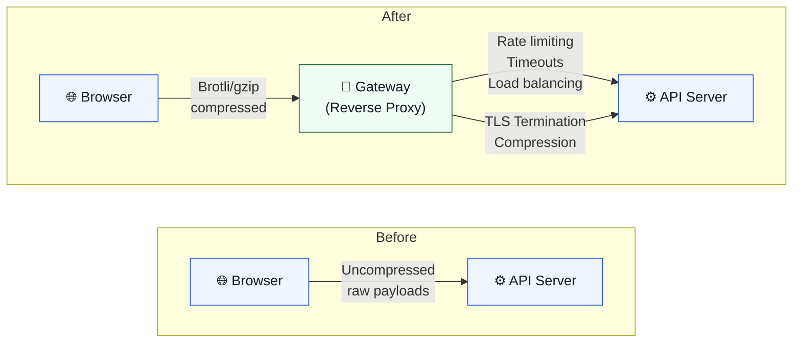

This single addition enables: consistent compression (gzip/Brotli for text-like responses), TLS termination, basic load balancing, and a natural choke point for overload controls.

Compression shifts work to CPU, so tune by content type: compress text-like responses aggressively, skip already-compressed media formats. Also use this gateway layer to enforce timeouts, rate-limit expensive endpoints, and shed non-critical work during saturation events.

> **Overload controls here mean intentional rejection** — rate limiting and load shedding — which can feel scary until you realize the alternative is a full outage. SRE guidance treats overload handling as essential to preventing cascading failure modes.

---

### Weeks 4–5: "Uploading high-res photos often hangs or times out"

- **Problem:** Long-running operations inside a synchronous request amplify tail latency and increase the chance of timeouts and retries. The upload endpoint was spending seconds resizing and storing 2–5 MB images on the same thread serving the HTTP response.
- **Locate it:** Distributed traces identify slow spans. Backend metrics confirm CPU and memory spike on image processing. Average upload latency crept above 10 seconds.
- **Root cause:** Coordination plus compute/I/O — expensive work on the request path.
- **Architectural change:** Add an asynchronous boundary so the API returns immediately and work completes out of band.

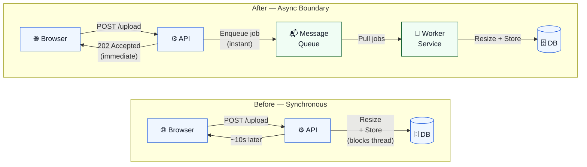

The upload endpoint now quickly stores the raw image and enqueues a background job. A separate worker service pulls jobs and performs the heavy image transformations. Web threads are freed immediately, the HTTP response returns a job ID, and the user sees an "Upload accepted" confirmation.

> *"Asynchronous processing increases throughput but adds queue wait time. Users lose immediate feedback — design for that explicitly."*

Reliability semantics matter here. Use broker guarantees explicitly — message acknowledgements and publisher confirms — rather than assuming reliability "just happens." Design idempotency into your retry policy so retries don't multiply side effects.

#### Queue vs. Stream: Choose Based on Semantics

| Dimension | Task Queue (e.g. RabbitMQ) | Event Stream (e.g. Kafka) |
|---|---|---|
| **Primary goal** | Do this task exactly once | Record events; many consumers can replay |
| **Delivery** | At-least-once with acknowledgements | Consumer offset tracking + replay |
| **Ordering** | Per-queue or per-consumer guarantee | Ordering within partitions |
| **Backpressure signal** | Queue depth / consumer lag | Consumer lag / processing delay |
| **Choose when…** | Async job execution is the main need | Durable event capture and replayable consumption |

> **Decision Checklist: Queue vs. Stream**
>
> - Is the output a task result (queue) or an event record meant for multiple downstream uses (stream)?
> - Do you need replay for new consumers and backfills (stream) or just "do it once" (queue)?
> - Can the operation tolerate at-least-once delivery and duplicates? (Almost always yes, if the handler is idempotent.)

---

### Weeks 5–6: "Browsing the event feed is sluggish when many people are on at once"

- **Problem:** Repeated reads for "hot" data waste database resources and inflate latency. The feed API was dynamically rendering recent posts for each user, recomputing identical queries repeatedly.
- **Locate it:** Track cache hit ratio, DB QPS, and latency deltas. p95 API latency for feed queries jumped under load; DB CPU hit high levels. Identical feed queries appeared repeatedly in slow query logs.
- **Root cause:** Data plus I/O — read amplification from repeated identical queries.
- **Architectural change:** Apply cache-aside semantics, then add read replicas to offload analytical and reporting queries from the primary.

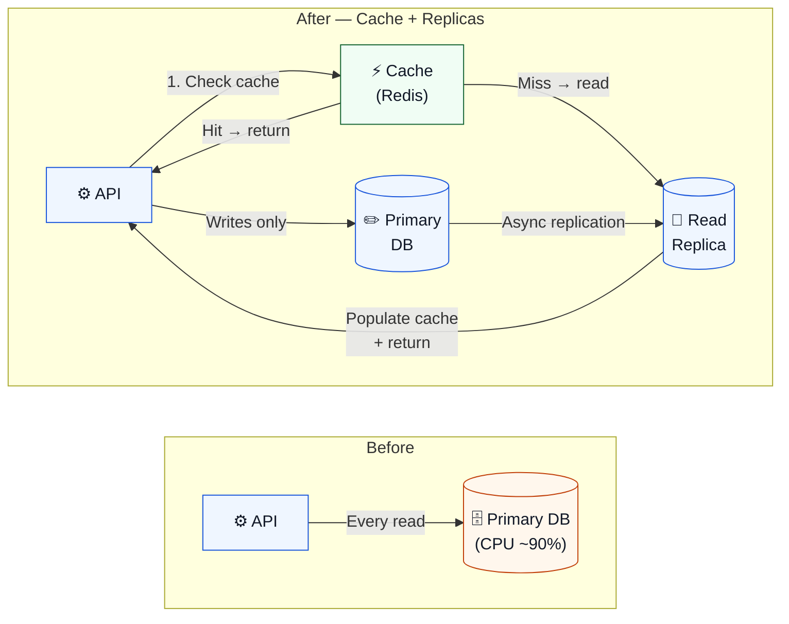

Caching can cut read latency dramatically — by 100× or more for hot data. But you must decide how fresh the feed needs to be. A few seconds of staleness is usually acceptable; minutes is not. Stagger TTLs slightly to prevent "thundering herd" cache misses when many entries expire simultaneously.

> *"After adding the cache, our 75th-percentile feed-load time dropped from ~4 seconds to under 500ms. Users notice the difference."*
> — Engineering team, Week 6

> **⚠️ Trade-Offs**
>
> - Cache-aside does not guarantee perfect consistency. Decide acceptable staleness and invalidation rules before you deploy.
> - Read replicas introduce replication lag. Watch for "read-your-writes" anomalies in features where users expect to see their own updates immediately.
> - You now manage replication, lag, cache invalidation, and read routing logic. These are manageable costs compared to sharding — but they're not free.

---

### Weeks 6–7: "We see DB locks and write contention during peak updates"

- **Problem:** The Posts table is growing; write transactions cause row locks and slow p99 writes. Reports slow down every month.
- **Locate it:** Use `EXPLAIN` and verify whether partition pruning occurs. The slow query log surfaces statements exceeding the threshold.
- **Root cause:** Data plus I/O — too much data scanned per query. Partitioning enables pruning (skipping partitions where no matching values can exist), which reduces the scan.
- **Architectural change:** Partition by a key that appears in common query predicates — often a time range for event-based data.

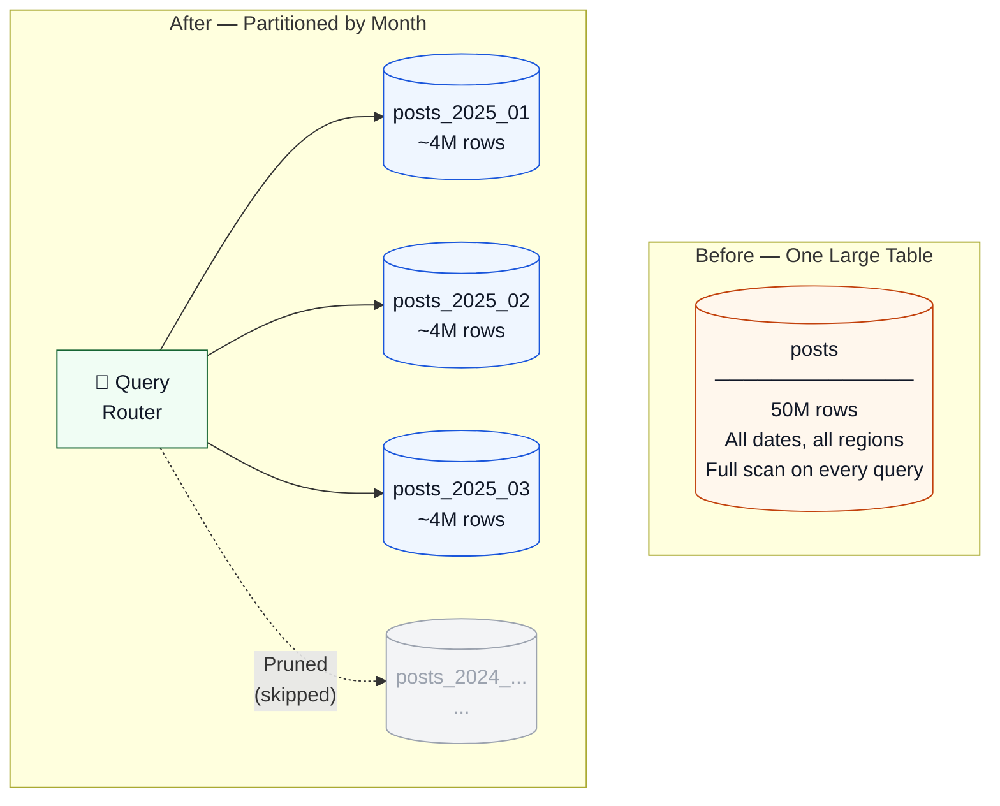

The key discipline is alignment: partitioning helps most when queries consistently filter on the partition key. If they don't, the pruning benefit disappears and you've added schema complexity for nothing. Before partitioning, confirm that slow queries are identified and fixed (slow log + `EXPLAIN`), and that you're not just papering over a missing index.

---

### Weeks 7–8: "Even after partitioning, our DB server is maxed out"

- **Problem:** A single database instance cannot scale write throughput indefinitely. You eventually hit CPU, I/O, lock contention, or storage constraints.
- **Locate it:** Sustained saturation on the primary, rising lock waits, and write latency increases even after query tuning and read offload. CPU and memory at 100%. Scaling up vertically is prohibitively expensive.
- **Root cause:** Data plus coordination (contention) and I/O — the single-node write scaling limit.
- **Architectural change:** Introduce sharding with a routing layer.

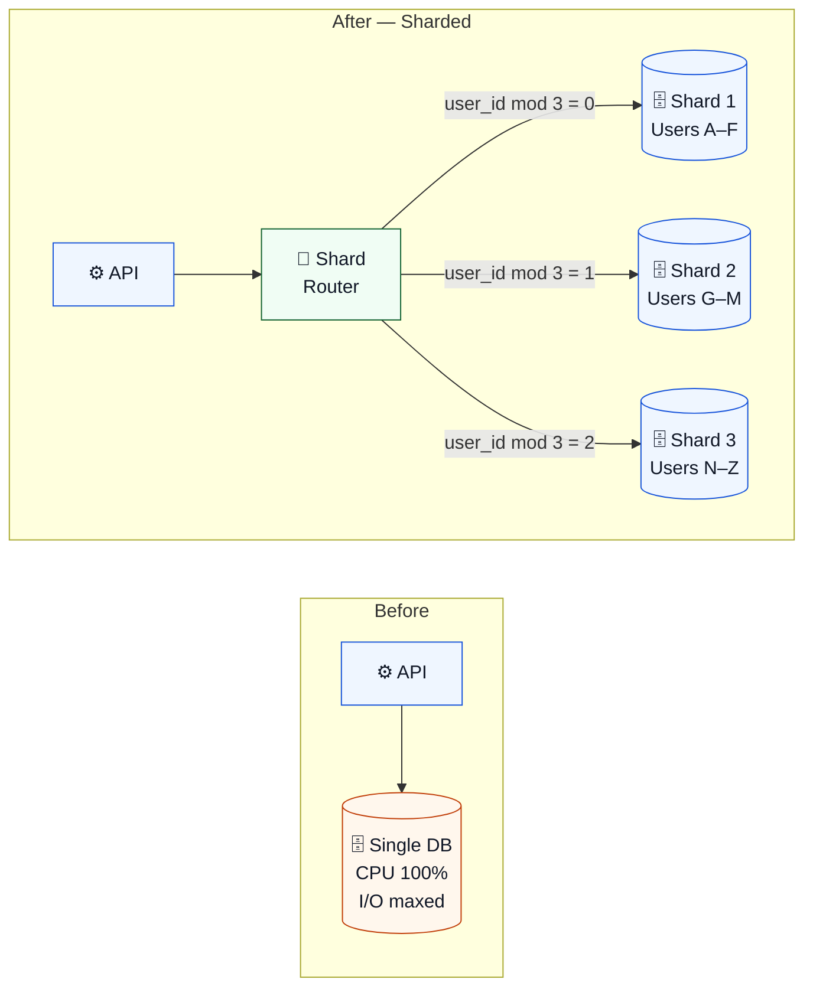

Sharding is a **first-class product decision**: your sharding key must match your access patterns. Get it wrong and cross-shard queries become painful. Tools like Vitess (MySQL-compatible) provide sharding schemes using vindexes and keyspace IDs to map rows to shards, and handle the routing layer.

> **⚠️ Before You Shard — Reality Check**
>
> - ✅ Are slow queries identified and fixed (slow log + EXPLAIN)?
> - ✅ Have you offloaded reads (replicas) and hot reads (cache)?
> - ✅ Do you have a stable sharding key / tenant key that matches access patterns?
> - ✅ Are you ready to redesign features that rely on global transactions or cross-shard queries?

---

### Weeks 8–9: "Global users still see uneven performance by region"

- **Problem:** High tail latency for some regions, inconsistent RUM data. The CDN handles static assets, but dynamic API responses still round-trip to a single region.
- **Locate it:** RUM shows p95/p99 latency varying significantly by geography. Trace data confirms the extra hops for distant API calls.
- **Root cause:** Geo-distribution limits — network physics applied to dynamic traffic.
- **Architectural change:** Deploy multi-region infrastructure.

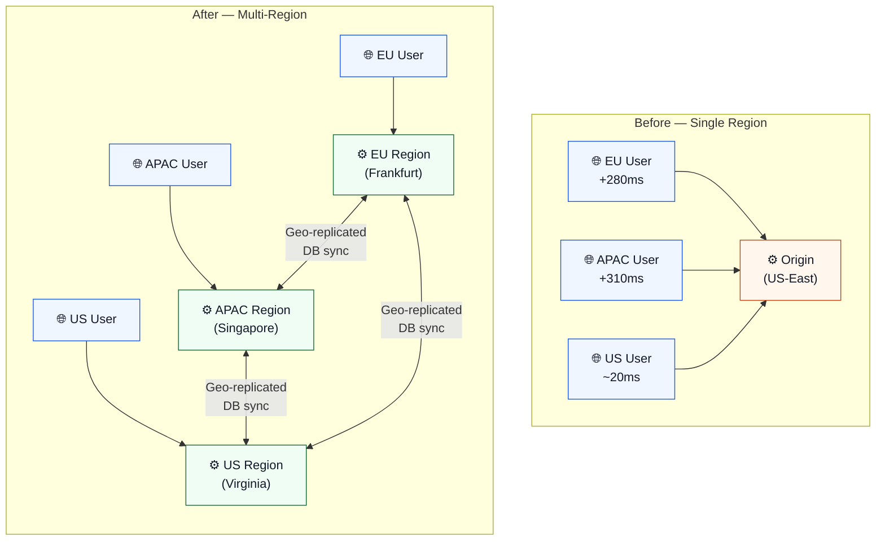

Data consistency becomes the central design decision at this stage. Read-your-writes guarantees, replication lag tolerances, and conflict resolution strategies all need explicit policies. This is not a problem you can defer until after deployment.

---

## Nine Weeks at a Glance

Every complaint, metric, root cause, and fix in one view.

| Wk | Complaint | Key Metrics | Root Cause | Fix | Trade-Off |
|---|---|---|---|---|---|
| **1** | "Feels a bit slow even locally." | TTFB 150–300ms, LCP ~2–3s | Baseline monolith, no cache | Add monitoring; set SLIs/SLOs | Minimal |
| **2–3** | "Out-of-city friends say it's very slow." | TTFB >1s remote, p95 spikes | Network distance, static origin | CDN edge cache for static assets | Cache invalidation complexity |
| **3–4** | "The feed page is slow to render." | High LCP, large payload sizes | Network bandwidth + transfer size | API gateway + compression + load balancing | CPU for compress/decompress |
| **4–5** | "Uploading photos hangs or times out." | Upload latency >10s, CPU spikes | Blocking I/O on request path | Async queue + worker service | Eventual consistency, no immediate ACK |
| **5–6** | "Feed is sluggish under load." | Feed p95↑, DB CPU ~90%, repeat queries | Read amplification | Cache-aside + read replicas | Stale cache data, replication lag |
| **6–7** | "DB locks during peak writes." | Write p99↑, row lock frequency↑ | Hot partitions in large table | Partition table by date/region | Schema complexity, limited cross-partition joins |
| **7–8** | "Primary DB is at capacity." | CPU/mem at 100%, I/O wait↑ | Single-node write scaling limit | Shard DB with routing layer | Operational complexity, cross-shard joins |
| **8–9** | "Global users see uneven performance." | RUM p95/p99 varies by region | Geo-distribution limits | Multi-region: geo-replicated DB + regional servers | Data consistency design required |

---

## Application Layer: Concurrency and Compute Isolation

### Worker Pools: Protect Latency by Isolating CPU-Heavy Work

- **Problem:** CPU-bound tasks executed on request handlers inflate tail latency and can starve the system under concurrency. Analytics jobs, report generation, and image processing can all exhibit this behavior.
- **Stakeholder phrasing:** "Analytics jobs slow down the entire system." "The system freezes under traffic spikes."
- **Locate it:** Correlate CPU spikes with request latency. If latency increases with CPU saturation, you likely have CPU-heavy work on the request path or insufficient isolation.
- **Root cause:** Compute plus coordination — queueing under saturation.
- **Architectural change:** Add a worker pool so the API can hand off heavy work without blocking request handling.

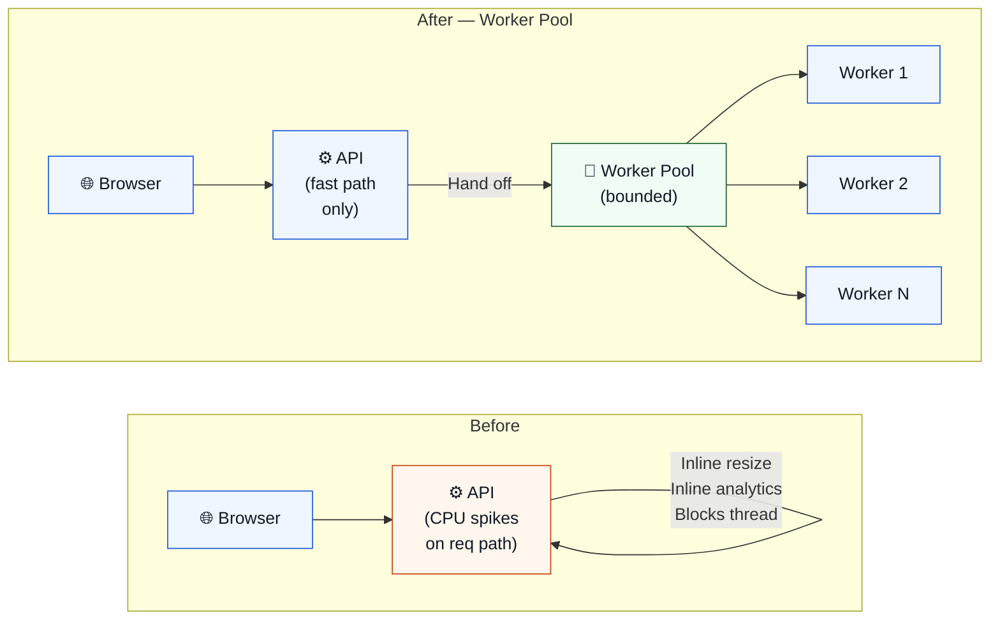

The ["Tail at Scale"](https://research.google/pubs/the-tail-at-scale/) argument applies directly here: variability and outliers matter. Isolating CPU-intensive work keeps user-facing paths predictable even when heavy jobs are running.

**Implement bounded queues.** Define what happens when the pool is saturated — reject, degrade gracefully, or delay. Without an explicit policy, an overloaded worker pool just moves the bottleneck.

### Distributed Computation: When One Node Can't Process the Dataset

- **Problem:** Some workloads exceed a single node's compute or memory capacity and require distributed processing: batch analytics, large-scale aggregation, historical report generation.
- **Locate it:** If processing time grows linearly with data volume and cannot meet deadlines on a single node even with optimization, distribution becomes necessary.
- **Root cause:** Compute plus I/O at scale.
- **Architectural change:** Use a distributed computation model (MapReduce-style frameworks that parallelize work across clusters and handle failures and data movement internally).

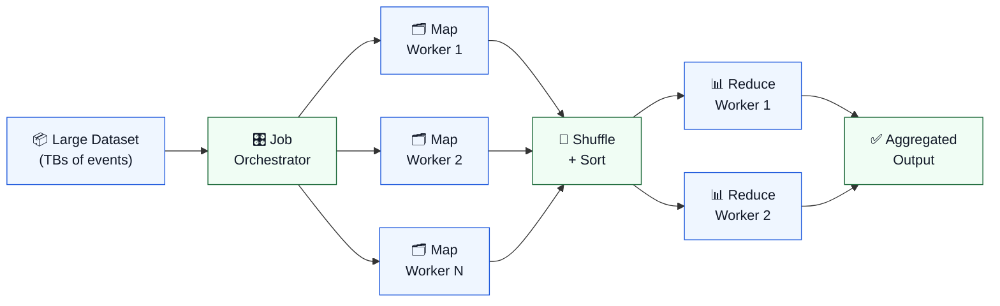

Significant operational complexity and orchestration overhead accompany this tier. It's rarely your first move for request/response performance — but essential once your analytical needs exceed what a single node can handle within acceptable time windows.

---

## Data Layer Scalability: The Right Order of Operations

The most expensive performance lesson is learning sharding before learning query tuning. **The progression matters enormously.**

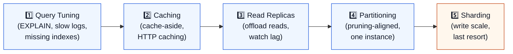

### Step 1: Query Tuning — Squeeze the Obvious Wins

Growing tables and new feature queries degrade performance via inefficient scans, missing indexes, and slow joins — often far earlier than you expect. Enable and analyze slow query logs; use `EXPLAIN` to inspect execution plans. No new infrastructure boxes yet. This is still architecture, because it reshapes load and removes unnecessary work.

### Step 2: Caching — Buy Speed with Freshness Risk

Once queries are tuned, repeated reads for hot data are the next target. Cache-aside is the baseline pattern: read from cache; on miss, read DB and populate cache. HTTP caching (`Cache-Control`, ETags, `304 Not Modified`) adds a complementary layer for API responses.

### Step 3: Read Replicas — Scale Reads Before You Split Writes

Read-heavy workloads saturate a single primary even if writes are modest. Replication offloads reads, but it's typically asynchronous — so you can observe replication lag and read-your-writes anomalies. Route analytics and reporting queries to replicas; keep writes on the primary.

### Step 4: Partitioning — Make Large Tables Manageable

Partitioning improves performance when it enables partition pruning: skipping partitions that cannot contain matching values. Partition by a key that appears in common query predicates (often time ranges for event data). This is still one DB instance with a different physical layout.

### Step 5: Sharding — Scale Writes by Splitting the Database

Sharding is the last resort. It introduces cross-shard query complexity, operational overhead, and a sharding key that becomes a first-class product decision. But when you've exhausted the earlier steps and write throughput is the binding constraint, it's the right tool.

| Approach | What It Solves | What It Doesn't Solve |
|---|---|---|
| **Query tuning** | Inefficient access patterns; unnecessary work | Fundamental volume limits |
| **Caching** | Read amplification from repeated identical queries | Write-heavy workloads; consistency requirements |
| **Read replicas** | Read load on primary | Write throughput; replication lag |
| **Partitioning** | Large-table manageability + pruning benefits | Write throughput limit of one instance |
| **Sharding** | Write scalability by splitting data across instances | Cross-shard queries and operational complexity |

---

## Rollout Discipline: Avoiding "Performance Improvements" That Cause Incidents

Every change described in this article has caused at least one incident somewhere. Not because the changes were wrong, but because they were deployed without sufficient care.

> **Rollout Checklist**
>
> - ✅ Ship behind a feature flag; ramp gradually by traffic percentage.
> - ✅ Define success criteria in advance: SLO adherence and p95/p99 deltas.
> - ✅ Watch for error-rate spikes and saturation signals during rollout.
> - ✅ Have a rollback or disable path that doesn't require a full redeployment.
> - ✅ Don't declare success until you've seen the system through a peak traffic window.

---

## The Architecture Evolution Timeline

A performance-aware architecture typically evolves through constraint-driven steps. Here's the full progression as a timeline diagram — each stage triggered by a real signal, not a best-practice checklist.

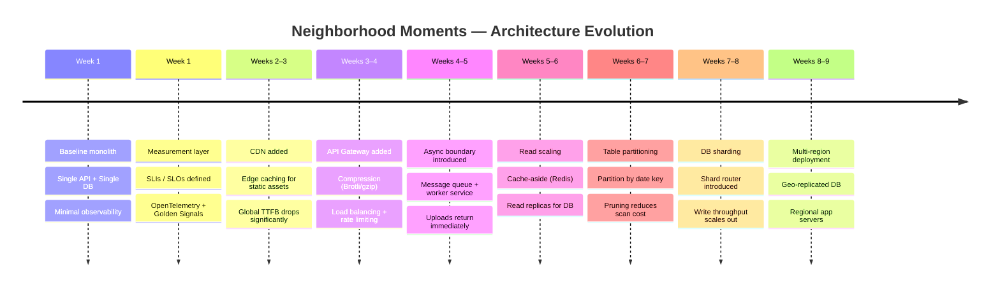

---

## The Full Final Architecture

Here's what the system looks like by Week 9 — every layer added in response to a named, measured constraint.

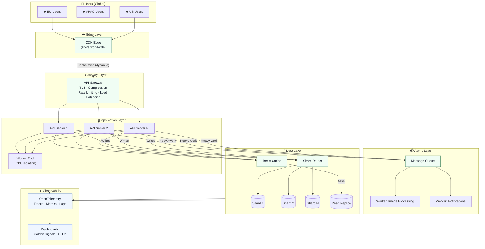

---

## Closing: If You Can Name It, You Can Fix It

Performance issues are often communication issues. When someone says "it's slow," they might be describing bandwidth, global latency, tail spikes, saturation, locking, coordination overhead, or overload collapse. Each of those has a different fix.

The analytical framework in this article — name the constraint, measure it, classify it, change one thing, accept the trade-off — is repeatable precisely because it doesn't depend on the specific technology stack. CDNs and queues and caches and shards are instantiations of general patterns. The patterns are what transfer.

> *"If you can name it, you can measure it. If you can measure it, you can change the architecture — one constraint at a time."*

**Start with measurement.** Build the ability to answer the basic question — what got slower, for whom, and why — before you reach for any architectural lever. Every change after that follows from the data.

---

## Terminology Appendix

| Term | Definition |
|---|---|
| **Latency vs. throughput** | Latency is time per operation; throughput is operations per unit time. Saturation often couples them — when resources are fully utilized, latency rises as throughput approaches its limit. |
| **Tail latency (p95/p99)** | The slowest slice of requests. Often dominates perceived reliability at scale because composed service calls amplify outliers. |
| **SLI / SLO** | Service Level Indicator: the metric you measure. Service Level Objective: the target for that metric. Error budgets make the tension between reliability and velocity explicit. |
| **Golden signals** | Latency, traffic, errors, and saturation. Google's SRE guidance identifies these as covering most user-impacting failures. |
| **USE method** | Utilization, Saturation, Errors. A framework (Brendan Gregg) for quickly identifying resource bottlenecks. |
| **RED method** | Rate, Errors, Duration. A framework (Tom Wilkie) for request-driven service dashboards. |
| **TTFB** | Time to First Byte. Measures time from navigation start until the first response byte arrives. Reflects both network round-trip and backend processing time. |
| **LCP** | Largest Contentful Paint. Google Core Web Vitals metric for perceived load speed. Target: under 2.5 seconds. |
| **Cache-aside** | Read from cache first; on miss, read from DB and populate cache. Does not guarantee perfect consistency — staleness and invalidation must be designed explicitly. |
| **Saturation** | Queued work or resource pressure beyond comfortable capacity. A primary signal of bottlenecks in the USE method. |
| **Backpressure** | A mechanism to prevent unbounded buffering when producers outpace consumers. Essential for async processing across service boundaries. |
| **Eventual consistency** | Common when using caches, replicas, and async processing. Consistency becomes a design decision rather than an assumption. |
| **Horizontal vs. vertical scaling** | Horizontal: adding more machines. Vertical: adding resources to one machine. Load balancing is typically required for horizontal scaling. |
| **Partition pruning** | A DB optimization where the query planner skips partitions that cannot contain matching values. Requires query predicates to align with the partition key. |
| **Sharding key** | The field used to route rows to specific shards. Choosing it is a product decision: it determines which queries are fast and which require cross-shard joins. |

---

*Tagged: Architecture · Performance Engineering · Distributed Systems · SRE · Backend Development*
