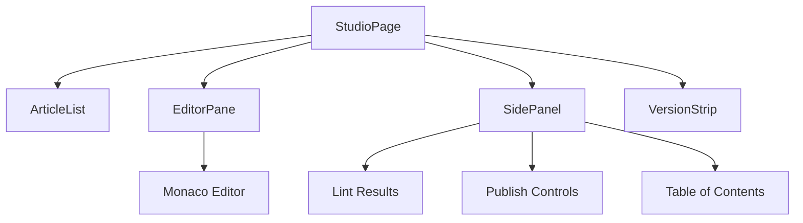

# Visualizing Systems with Mermaid

Mermaid lets you write diagrams as code — version-controlled, diff-able, and always in sync with your docs.

## Component Architecture

Diagrams live next to the prose that describes them. No more stale architecture docs.
